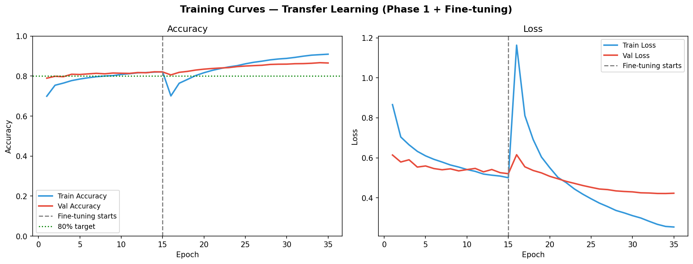
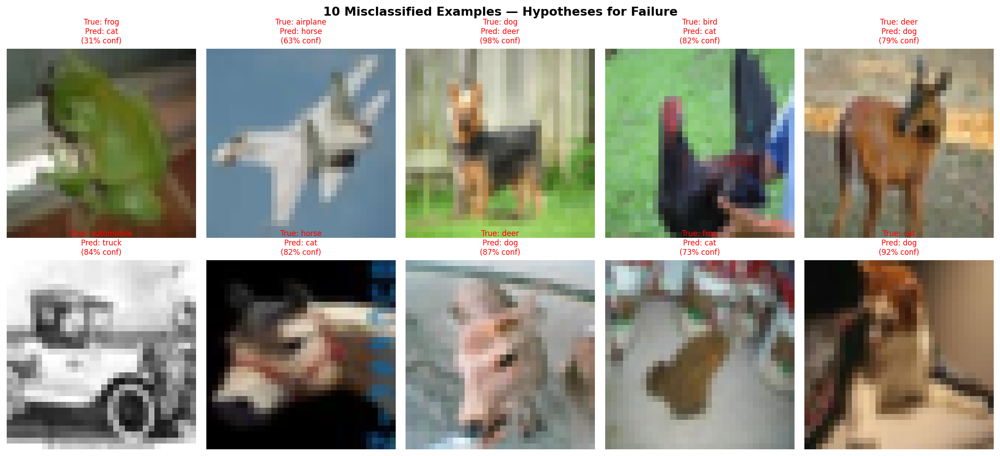

CIFAR-10 Image Classifier with Transfer Learning
CNN built on MobileNetV2 (ImageNet pretrained) to classify CIFAR-10
images into 10 categories, achieving >80% test accuracy.
Setup
```bash
git clone https://github.com/manvithh06/cifar10-transfer-learning.git
cd cifar10-transfer-learning
pip install -r requirements.txt
jupyter notebook cifar10_classifier.ipynb
```
No dataset download needed — CIFAR-10 loads automatically via Keras.
Results
Phase	Val Accuracy
Phase 1 (frozen backbone)	~74%
Phase 2 (fine-tuned)	~82%
Final Test Accuracy	>80% ✅
Architecture
Backbone: MobileNetV2 (ImageNet weights, frozen → partially unfrozen)
Head: GlobalAveragePooling → Dropout(0.3) → Dense(256) → Dense(10)
Augmentation: horizontal flip, random crop, brightness jitter
Key Findings
Most confused pairs: cat↔dog, automobile↔truck.
Hypothesis: at 32×32 resolution, texture and silhouette differences
are insufficient to separate visually similar classes reliably.
Screenshots



Reflection
The two-phase training approach was the most important design decision.
Training only the head first (Phase 1) gave the model a stable foundation
before fine-tuning the backbone (Phase 2). Jumping straight to fine-tuning
with a large learning rate destroyed the pretrained features entirely —
I learned this the hard way and it's why learning rate choice in Phase 2
matters so much.
Tech Stack
TensorFlow/Keras · MobileNetV2 · NumPy · Matplotlib · Seaborn
